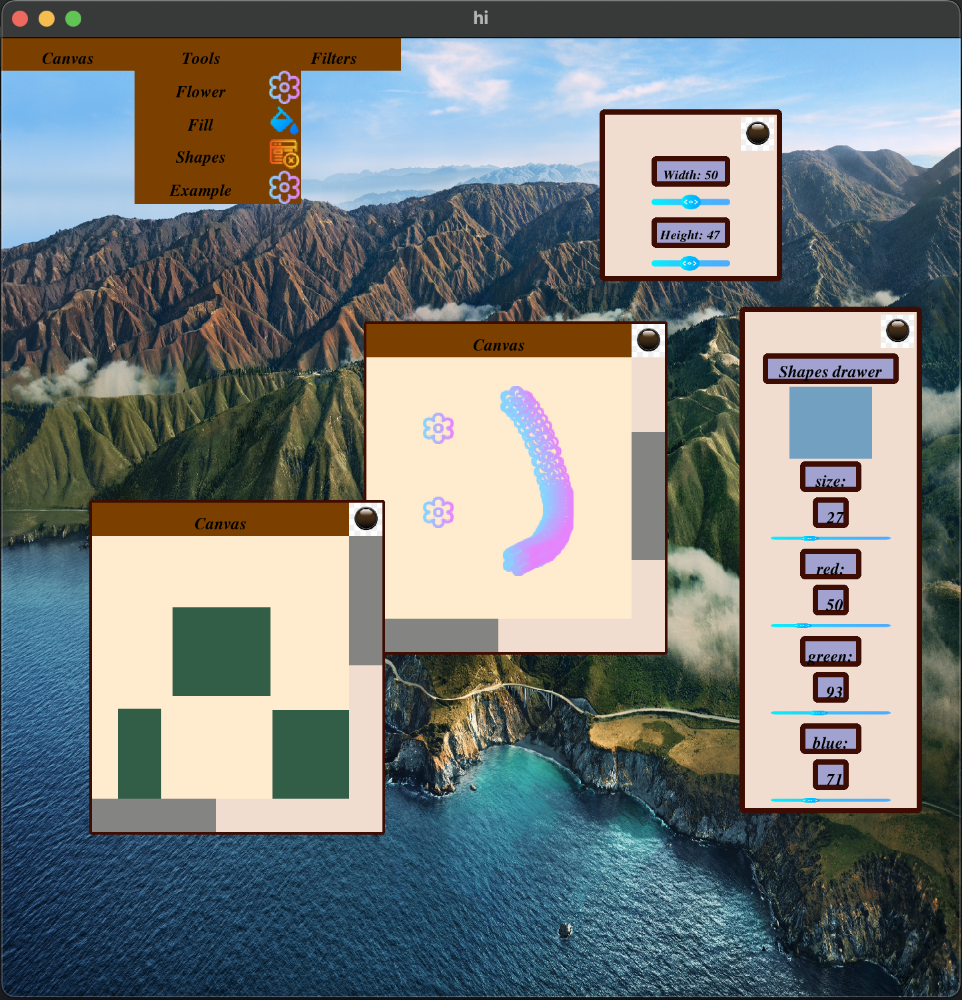

# My gui application with plugin system
Interface of gui is intuitive. You can write plugin based on `plugin/plugin.hpp` API.
Then you put it in directory `res` and run your application.
There are two types of plugins: filters and tools.
Take a look what you can get:



## Build
To build program:
```
        git clone https://github.com/kefirRzevo/ComputerScience.git
        cd ComputerScience/gui
        mkdir build
        cd build
        make
```
