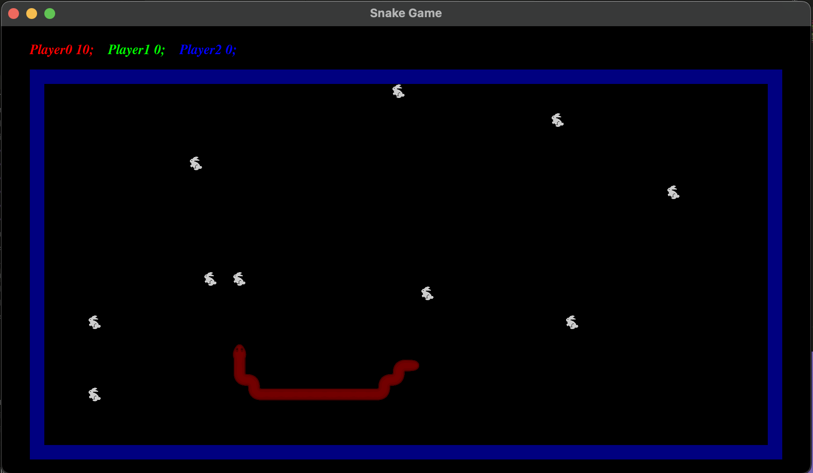
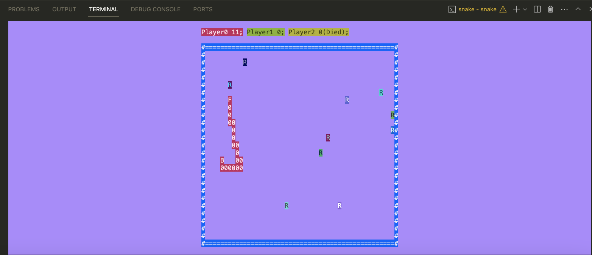

# Snake game
This is my realization of famous game -- snake. It is based on MVC pattern.
There are two types of view: text and graphic. I used `SFML` library to simplier visualization.
Interface is intuitive, so use arrows or WASD to control snakes.
Also, there are bots in the game.




## Build
To build program:
```
        git clone https://github.com/kefirRzevo/ComputerScience.git
        cd ComputerScience/snake
        mkdir build
        cd build
        make
```